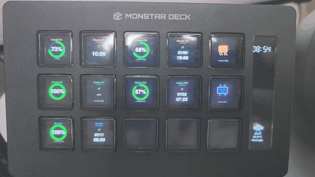

# deck-ai-usage

Show your remaining **Claude / Codex / Gemini** usage as live gauges on a
**Stream Dock (MONSTAR DECK)** — with experimental **Elgato Stream Deck** support.

스트림덱 계열 장치에 AI 사용량(Claude / Codex / Gemini)을 실시간 게이지로 띄웁니다.



## Actions (Category: AI Usage)

14 actions, one metric per key — full-size ring + remaining % + label + reset time:

| Gauge | Reset time | Character |
|---|---|---|
| Claude 5h / Claude Weekly | Claude 5h Reset / Weekly Reset | Claude character (usage-reactive animation) |
| Codex 5h / Codex Weekly | Codex 5h Reset / Weekly Reset | Codex TV character |
| Gemini 5h / Gemini Weekly | Gemini 5h Reset / Weekly Reset | |

Ring color reflects remaining %: green > 50, orange ≥ 20, red < 20.
Providers are distinguished by label and accent color.

## Install

### Stream Dock (MONSTAR DECK) — verified

    python3 scaffold_assets.py && bash install.sh

Then place any action (e.g. "Claude 5h") on a key in the Stream Dock app.

### Elgato Stream Deck — experimental

    python3 scaffold_assets.py && bash install_elgato.sh

The plugin code follows Elgato's plugin protocol (`connectElgatoStreamDeckSocket`,
`willAppear` / `setImage`), and `manifest.elgato.json` provides the SDKVersion 2
manifest Elgato requires. **Not yet verified on real Elgato hardware** — if the
gauges stay blank, the likely culprit is `fetch()` of the local `usage.json`
being blocked in Elgato's embedded browser. Bug reports welcome.

## Data feed

The plugin only reads one file: `plugin/data/usage.json` inside the installed
plugin folder. **Any script that writes this schema works** — cron, launchd,
your own monitor, anything:

```json
{
  "claude_5h": { "rem": 73, "reset": "07-16 14:00", "stale": false, "available": true },
  "claude_7d": { "rem": 41, "reset": "07-21 09:00", "stale": false, "available": true },
  "codex_5h":  { "rem": null, "reset": "", "stale": true, "available": false },
  "codex_7d":  { "rem": null, "reset": "", "stale": true, "available": false },
  "gemini":    { "rem": 90, "reset": "07-17 00:00", "stale": false, "available": true },
  "ts": 1752600000
}
```

- `rem` — remaining percent (0–100), `null` if unknown
- `reset` — human-readable reset time string (shown as-is)
- `stale` / `available` — dim the gauge / show "—" respectively
- `ts` — unix seconds of the last write; old `ts` also triggers the stale style

A reference writer is included: `writer/write_usage.py` converts a
`window.__tokenData = {...}` style JS status file into `usage.json`
(paths configurable via `TOKEN_STATUS_JS` and `STREAMDOCK_USAGE_JSON`
environment variables). Run it on a 30 s interval from any scheduler.

## After reinstalling the deck app

A `.pkg` reinstall may wipe custom plugins → re-run `bash install.sh`
(or `install_elgato.sh`).

## Tests

    node --test tests/helpers.test.js
    python3 -m pytest tests/ -q

## License

MIT
